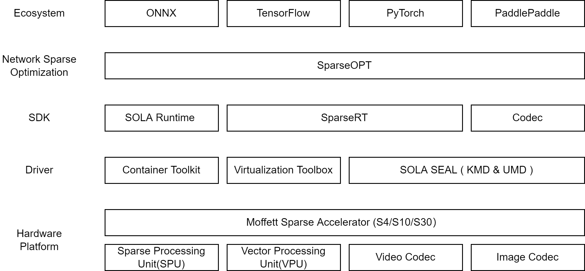
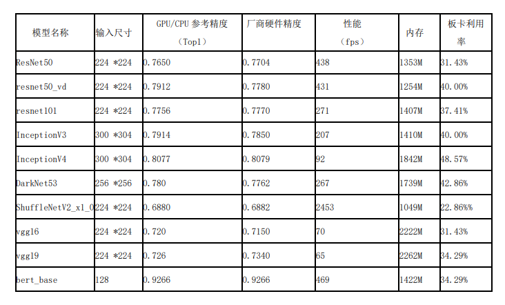

# 一、墨芯软件栈结构

墨芯软件栈主要包括5层，从顶层到底层分别为：

- 生态层：墨芯积极支持 AI领域的主流技术，帮助用户以最小的研发代价得到稀疏化的收益。目前支持 ONNX、TensorFlow、PyTorch、PaddlePaddle等。
- 稀疏化层：稀疏化推理需要算法和硬件的密切配合。墨芯提供了 SparseOPT组件，它与用户的训练框架协同工作，帮助用户训练稀疏的神经网络。
- SDK层，主要包括如下组件：
  - SparseRT：为用户提供稀疏化模型的编译、推理及调试能力，包括 Python、C++接口及相关工具。
  - Codec：为用户提供图像、视频的编解码开发接口。
  - SOLA Runtime：为用户提供更接近更灵活的硬件控制能力，助力用户开发复杂的高性能 AI应用。
- Driver层：为墨芯稀疏化 AI推理卡提供驱动能力，包括 SOLA SEAL ( KMD & UMD )、虚拟化组件、容器化组件等
- 硬件层：即墨芯稀疏化 AI推理卡，主要包含稀疏计算单元、向量计算单元、视频编解码器、图片编解码器等组件。




# 二、 paddle模型开发测试流程
  paddle模型在moffett的板卡上运行需要进行模型编译和模型推理两个步骤
     
## 2.1 模型编译
  1) 创建paddle模型目录，放入paddle模型文件
  - example
  ```
    #resnet50
    mkdir -p /my_project/paddle_model/resnet50
    cd /my_project/paddle2onnx/paddle_model/resnet50
    wget https://paddle-imagenet-models-name.bj.bcebos.com/dygraph/inference/ResNet50_infer.tar
    #bert
    mkdir -p /my_project/paddle_model/bert_base_uncased
    把训练的bert模型放入/my_project/paddle_model/bert_base_uncased目录下
  ```
  2) 将paddle模型编译为runtime可执行的model.bin文件
  - example
  ```
  #PaddleClass Model
  python3 compiler/compile_PaddleClas.py /my_project/paddle_model/resnet50/inference.pdmodel -o compile_output/resnet50
  #Bert Model
  python3 compiler/compile_bert_base.py /my_project/paddle_model/bert_base_uncased/inference.pdmodel -o compile_output/bert-base-uncased
  ```
## 2.2 板卡上推理
  在moffett板卡使用编译生成的模型文件modle.bin进行推理测试。

  由于需要测试PaddleClass和PaddleNlp的模型精度，测试用的PipeLine是基于Paddle的PaddleClass(release/2.5)仓库和PaddleNLP(release/2.5)仓库。
  - example
  ```
  #PaddleClass Model
  cd /home/moffett/workspace/paddle/PaddleClas
  sudo python3 tools/eval.py -c ppcls/configs/ImageNet/ResNet/ResNet50.yaml -m ./my_projectcompile_output/resnet50/model.bin
  #Bert Model
  cd /my_project/PaddleNLP/model_zoo/bert
  sudo bash test_accuracy.sh /my_project/compile_output/bert-base-uncased/uncased/model.bin

  ```
 # 三、model_zoo/Benchmark
 目前测试完成10个paddle模型的全流程测试，后续将不断丰富完善模型库。10个模型在moffett s4卡上的测试结果如下。
  
 
  
<!-- @latexonly
$$ \makebox{图1 墨芯软件栈结构} $$
@endlatexonly -->
